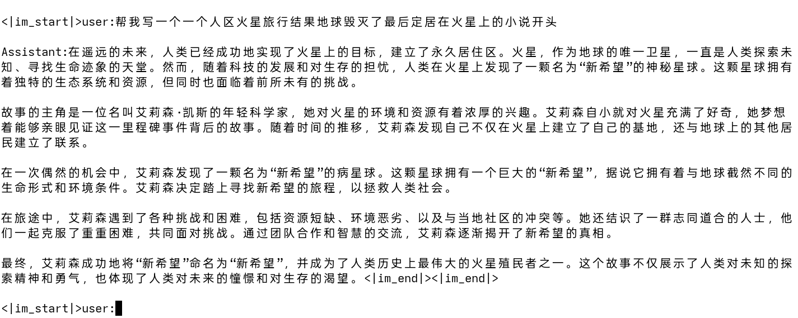
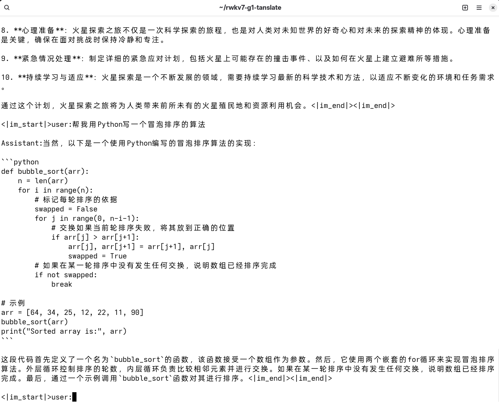
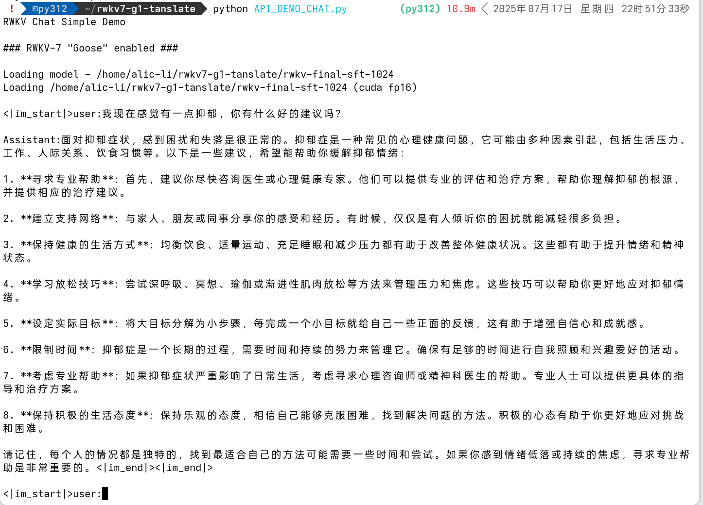

# 🪿 Mini-RWKV-V7-LM 
🚀 让我们来从头训练一个属于自己的Mini-RWKV-7吧~ 小小的鹅也能飞得很高喔~

<div align="center">
  
</div>

## 🌟 模型简介

本模型是基于 **RWKV-V7 架构** 训练的一个 **34M 参数量** 的语言模型`Mini-RWKV-V7-LM-34M`。它在保持轻量的同时，具备良好的语言理解和生成能力，非常适合资源极其有限的设备部署和快速迭代开发。

---

## 📦 模型结构

| 参数 | 数值 |
|------|------|
| 参数量 | 34.2M 🎯 |
| 层数 | 8 🧱 |
| 隐藏维度 | 512 📐 |
| 上下文长度 | 512->1024->2048 📏 |
| 词表大小 | 6400 📚 |
- Vocab 和MiniMind的保持一致
---

## 🧪 训练信息

- 🪿 架构：[RWKV-V7](https://github.com/BlinkDL/RWKV-LM) 
- 📚 数据源：[minimind_dataset](https://huggingface.co/datasets/jingyaogong/minimind_dataset) 特别感谢MiniMind的作者 [@jingyaogong](https://github.com/jingyaogong)开源了训练数据集 🤗
- 📈 学习率：动态调整  
- 🖥️ 硬件：可以使用4060laptop等显卡进行训练，甚至Radeon 780M 核显也可以在轻薄本上进行训练 😜
- 👀我是在AMD Instinct MI300X 上快速复现的(十分感谢AMD公司的对我个人以及RWKV的云算力赞助)😊
- 📦 模型大小：68.4MB 参数量 34.2M Params
- 📊 预损失曲线：预训练收敛稳定 loss = 2.12左右波动(因为预训练数据量比较少) 
- 📊 SFT训练损失曲线 SFT训练最终loss=0.5左右波动  

---
## 🎉 效果展示



---

## 📚 支持任务

- 📝 预训练（Pre-training）
- 📚 监督微调训练（Supervised fine-tuning [SFT]）
---

## 🧰 推理方法

### 🐍 安装依赖

```bash
pip install -r requirements.txt
```
- 如果你使用的是AMD Instinct MI300X等别的AMD显卡，请不要安装requirements.txt中的torch，请安装对应最新版本的torch
- 比如说```pip3 install torch --index-url https://download.pytorch.org/whl/rocm6.3```
- 具体安装指令可以参考[Pytorch官网下载链接](https://pytorch.org/get-started/locally/)


### 🧪 加载模型 & 推理示例

```bash
python3 ./API_DEMO_CHAT.py
```

# 🚀开始训练
## 🗒️ 准备数据集

### 📥 数据集下载
```bash
modelscope download --dataset gongjy/minimind_dataset sft_512.jsonl sft_1024.jsonl sft_2048.jsonl pretrain_hq.jsonl sft_mini_512.jsonl --local_dir ./minimind_dataset
```
### 🛠️ 预训练Binidx数据集转换
```bash
python3 ./data/make_data.py pretrain_hq.jsonl 1 512
```
- 这里的1是只重复一遍数据集, 512是上下文长度 

## 📦 stage 1 模型权重初始化(initialization model weights)
```bash
sh ./demo-training-prepare.sh
```
- 执行后会生成一个```./out/L8-D512-x070```文件夹，里面有初始化的模型权重文件,名为```rwkv-init.pth```

## 📚 stage 2 预训练(Pre-training)
```bash
sh ./demo-training-run.sh
```
- 修改第28行的```M_BSZ="16"```可以调整batch size
- 修改第52行的``` --wandb "" ```可以启动wandb记录训练过程
- 训练完成后会生成一个最终权重```./out/L8-D512-x070```文件夹里面有训练好的模型权重文件,名为```rwkv-final.pth```

## 🎯 stage 3 监督微调训练(Supervised fine-tuning [SFT])_ctx_512
- 训练之前删除```./out/L8-D512-x070```文件夹里面的```rwkv-init.pth```初始权重文件
- 然后将```./out/L8-D512-x070```文件夹里面的```rwkv-final.pth```权重文件改名为```rwkv-init.pth```来作为初始权重文件进行Post-training继续训练
- 按照数据集Token数对照表的数据集信息修改对应的配置参数
```bash
CTX_LEN="512"
MY_EXIT_TOKENS="1843253579"
MAGIC_PRIME="3600053"
DATA_FILE=[your data file path]
```
```bash
sh ./demo-training-run-sft.sh
```

## 🎯 stage 4 监督微调训练(Supervised fine-tuning [SFT])_ctx_1024
- 训练之前删除```./out/L8-D512-x070```文件夹里面的```rwkv-init.pth```初始权重文件
- 然后将```./out/L8-D512-x070```文件夹里面的```rwkv-final.pth```权重文件改名为```rwkv-init.pth```来作为初始权重文件进行Post-training继续训练
- 按照数据集Token数对照表的数据集信息修改对应的配置参数
```bash
CTX_LEN="1024"
MY_EXIT_TOKENS="1430197426"
MAGIC_PRIME="1396673"
DATA_FILE=[you data file path]
```
```bash
sh ./demo-training-run-sft.sh
```

## 🎯 stage 5 监督微调训练(Supervised fine-tuning [SFT])_ctx_2048
- 训练之前删除```./out/L8-D512-x070```文件夹里面的```rwkv-init.pth```初始权重文件
- 然后将```./out/L8-D512-x070```文件夹里面的```rwkv-final.pth```权重文件改名为```rwkv-init.pth```来作为初始权重文件进行Post-training继续训练
- 按照数据集Token数对照表的数据集信息修改对应的配置参数
```bash
CTX_LEN="2048"
MY_EXIT_TOKENS="2398644915"
MAGIC_PRIME="1171199"
DATA_FILE=[you data file path]
```
```bash
sh ./demo-training-run-sft.sh
```

## 🪿学习率建议(LR)
### 预训练(Pre-training) 
- LR_INIT=```6e-4``` LR_FINAL=```2e-5```
### 监督微调训练(Supervised fine-tuning [SFT]) 
- LR_INIT=```2e-5``` LR_FINAL=```1e-6```

## 💫数据集Token数对照表
Total tokens in sft_512.jsonl: 
- --my_exit_tokens ```1843253579``` --magic_prime ```3600053``` --ctx_len ```512```

Total tokens in sft_1024.jsonl: 
- --my_exit_tokens ```1430197426``` --magic_prime ```1396673``` --ctx_len ```1024```

Total tokens in sft_2048.jsonl: 
- --my_exit_tokens ```2398644915``` --magic_prime ```1171199``` --ctx_len ```2048```

## 📢 致谢

- 🖥️ 感谢AMD公司的对我个人以及RWKV的云算力赞助
- 🙌 感谢 RWKV 社区提供的开源代码和训练框架！
- 🚀 感谢 [MiniMind](https://github.com/jingyaogong/minimind)提供灵感！
- 如发现 bug 或有任何建议，欢迎提交 issue 或 PR 🛠️


---

## 🧩 相关项目推荐

- [MiniMind](https://github.com/jingyaogong/minimind):一个轻量级 LLM 教学项目 📚
- [RWKV_v7_G1_Translate](https://huggingface.co/Alic-Li/RWKV_v7_G1_Translate_ctx4096_20250620):一个基于RWKV-V7-G1全量微调的超轻量端侧中英翻译模型 💫 
- [RWKV-LM](https://github.com/BlinkDL/RWKV-LM):RWKV 官方架构仓库 🧠

---

🎉 感谢小伙伴们使用 **Mini_RWKV_7**！如果你喜欢这个项目，欢迎推给大家一起来玩！🌟

--- 
